# Broadcast Modes and Functional Paths — Ambient + Sessions

Comprehensive mode and functional flow for `BroadcastCoordinator` / `BroadcastRuntime`. Solid = HLS queue path, dashed = REST/batch DB-only path. See `server/broadcast/coordinator.ts`, `server/broadcast/ambient-pipeline.ts`, `server/broadcast/media-slots.ts`, `server/broadcast/runtime.ts`, `server/blocks/batch-generate.ts`, `server/game-loop/channel-tick.ts`.

```mermaid
flowchart TB
  %% ── Runtime & Desired State ──
  Runtime["BroadcastRuntime<br/>server/broadcast/runtime.ts:42<br/>loadBroadcastConfig + QueueBroadcastClient + RealtimeEngine 5s"]
  Desired{"desiredState<br/>storage: broadcast:{ch}:desired-state"}
  Desired -->|stopped| Stopped["MODE: stopped<br/>coordinator.ts:33 stop()<br/>abort + disposeAmbient + clear windows"]
  Desired -->|running| Produce{"produce() loop<br/>coordinator.ts:218<br/>while !aborted && running"}
  
  Produce --> SessionTimes{"time checks<br/>coordinator.ts:222-233<br/>now vs scheduledStart<br/>episodeDue / preRollDue<br/>active.scheduledEnd"}
  SessionTimes -->|active && now>=end| FinishSession["finishSession()<br/>coordinator.ts:764<br/>updateSessionStatus:completed<br/>mode->ambient"]
  SessionTimes --> SessionStatusNode["sessionStatus<br/>none / scheduled / preparing / active / completed<br/>coordinator.ts:237"]
  
  %% ── Streamer Gate (both paths) ──
  Produce --> StreamerCheck{"ensureStreamerAvailable()<br/>coordinator.ts:561<br/>client.health + client.getPlayback + slotClient()"}
  StreamerCheck -->|fail| Waiting["MODE: waiting_for_streamer<br/>coordinator.ts:601<br/>streamer.state=unavailable<br/>disposeAmbientPipeline()<br/>retry 2/5/10/30s<br/>coordinator.ts:54"]
  Waiting -->|retry wait| StreamerCheck
  StreamerCheck -->|ok| Branch{"episodeDue || preRollDue ?"}

  %% ── PRE-ROLL ──
  Branch -->|preRollDue && !episodeDue| Preparing["MODE: preparing<br/>coordinator.ts:254<br/>dispose check, staging only<br/>ensureStagedSlots(scheduled, 3)"]
  Preparing --> CanonicalPrep
  Branch -->|episodeDue| EpisodePath

  %% ── AMBIENT PATH (ephemeral) ──
  Branch -->|else: between episodes| AmbientMode["MODE: ambient<br/>coordinator.ts:259<br/>sessionStatus=scheduled/none"]
  AmbientMode --> AmbientPipeline["AmbientPipeline<br/>ambient-pipeline.ts:78<br/>bounded: ready 60s / 50MiB / 2 inflight / 3 distinct visuals<br/>coordinator.ts:299 ensureAmbientPipeline()"]

  subgraph AmbientGen["Ambient Generation - 3-stage bounded pipeline"]
    direction TB
    PendingFast{"1) Fast path<br/>pendingSegments.shift()<br/>coordinator.ts:314<br/>reserve ambientSequence++"}
    WindowChain{"2) WindowChain lock<br/>ambientWindow<br/>coordinator.ts:334<br/>if empty: loadAmbientChain()+ generateAmbientStoryWindow(ch, tail, 3)<br/>coordinator.ts:345<br/>fallback: tail slice or quiet interlude<br/>shift 1 CanonicalText<br/>push tail 2-block persist systemSettings ambient:chain<br/>coordinator.ts:360"}
    MediaAmbient{"3) Media concurrent<br/>prepareAmbientTurnFromText()<br/>media-slots.ts:189<br/>generateTurnMedia<br/>media-slots.ts:278-303<br/>retry image 3x + TTS 1x parallel<br/>fallback: getLastBlock -> getRandomImage<br/>media-slots.ts:356<br/>toUploadAsset Blob sha256<br/>splitAmbientTurn()<br/>coordinator.ts:453"}
    StageAmbient{"stageTurn<br/>coordinator.ts:402<br/>stageSlot: client.stageUpload image+audio<br/>coordinator.ts:850<br/>PartialSlotStageError -> image-only<br/>coordinator.ts:408"}
    ReleaseAmbient{"releaseNextSafe()<br/>ambient-pipeline.ts:158<br/>gate: releasedDistinct<3<br/>canReleaseTurn: now+reserved+safety<nextEpisodeStart<br/>ambient-pipeline.ts:371<br/>releaseTurn: client.releaseSlot<br/>coordinator.ts:417<br/>monitorJobs: watchJob 1s<br/>coordinator.ts:804"}
    PendingFast --> WindowChain --> MediaAmbient --> StageAmbient --> ReleaseAmbient
  end

  AmbientPipeline --> PendingFast
  ReleaseAmbient -->|released| StreamerQueue
  ReleaseAmbient -->|pending: buffer full| AmbientPipeline
  ReleaseAmbient -->|blocked: would cross episode| EpisodePath

  %% ── CANONICAL / SESSION PATH (durable) ──
  subgraph CanonicalPrepSub["Canonical Preparation - durable"]
    direction TB
    EnsureStaged{"ensureStagedSlots(session, minSlots)<br/>coordinator.ts:614<br/>target 3 pre-roll / 5 episode"}
    Recover{"recover: load blocks<br/>getBlocksBySessionOrdered<br/>for each slot: stageCanonicalSlot<br/>coordinator.ts:618<br/>hydrateCanonicalSlot via GCS/SDK<br/>media-slots.ts:247<br/>stageUpload image then audio retry"}
    GenerateCanonical{"while slotCount<min && now<end<br/>seed = lastBlock.content || getLastBlock()<br/>coordinator.ts:632<br/>canonicalTextWindow batch 3<br/>generateCanonicalStoryWindow()<br/>coordinator.ts:644<br/>finishCanonicalSlot()<br/>media-slots.ts:121<br/>generateTurnMedia -> archiveStoryImage+archiveSpeechBuffer GCS<br/>createBlock blocks+deliverySegments<br/>media-slots.ts:174<br/>slotsWithAssets idempotency session:block:segment<br/>media-slots.ts:315"}
    StageCanonical{"stageCanonicalSlot<br/>coordinator.ts:686<br/>persistSlotReceipts queueImageJobId/queueAudioJobId/queueSlotKey<br/>coordinator.ts:741"}
    EnsureStaged --> Recover --> GenerateCanonical --> StageCanonical
  end

  CanonicalPrep --> EnsureStaged
  EpisodePath["MODE: episode / preparing<br/>coordinator.ts:498 produceEpisode()"] --> EnsureStaged
  EnsureStaged --> PickCursor{"cursor = systemSettings broadcast:{ch}:session:{id}:cursor<br/>coordinator.ts:506<br/>slots=blocks.flatMap(slotsFromBlock)<br/>media-slots.ts:226<br/>slot=cursor"}
  PickCursor -->|no slot| EndEpisode
  PickCursor --> TopUp["topUp = ensureStagedSlots(cursor+4) concurrent<br/>coordinator.ts:529"]
  PickCursor --> SubmitSlot{"submitSlot()<br/>coordinator.ts:772<br/>stageAndReleaseSlot<br/>coordinator.ts:831<br/>stageSlot retry 3x isRetryable(0/429/5xx)<br/>coordinator.ts:1019<br/>Partial -> release image-only<br/>releaseStagedSlot slotKey<br/>onSubmitted: updateSessionStatus:active<br/>coordinator.ts:536<br/>mode=episode"}
  SubmitSlot -->|success| MonitorCanonical{"monitorSlotJobs<br/>coordinator.ts:820<br/>watchJob per slot<br/>coordinator.ts:805"}
  SubmitSlot -->|TerminalSlotError| SkipSlot["skip terminal slot<br/>coordinator.ts:544"]
  MonitorCanonical --> AdvanceCursor["set cursor++<br/>coordinator.ts:551<br/>await topUp<br/>loop -> Produce"]
  SkipSlot --> AdvanceCursor
  TopUp -.-> AdvanceCursor
  EndEpisode --> FinishSession

  %% ── Shared Streamer / Playback ──
  StageCanonical --> StreamerQueue
  SubmitSlot --> StreamerQueue
  StreamerQueue["QueueBroadcastClient SlotQueue<br/>stageUpload / releaseSlot / watchJob<br/>coordinator.ts:68"]
  StreamerQueue --> Streamer["Streamer / MediaMTX<br/>FIFO playout imageDuration safeImageDuration<br/>coordinator.ts:1003 max floor, max audio"]
  Streamer --> HLS["LiveDelivery HLS<br/>runtime.ts:193<br/>client.getPlayback().playbackManifestUrl<br/>GET /v1/stream manifest"]
  HLS --> PlaybackRoute["GET /api/channels/:ch/playback<br/>routes.ts:35 getPlaybackStatus()<br/>+ /api/admin/broadcasts/:ch"]
  PlaybackRoute --> Player["VideoDeliveryPlayer<br/>hls.js loadSource(manifestUrl)<br/>LiveBroadcastSection.tsx:32"]
  Player --> Viewer["Viewer"]
  HLS --> Watchdog{"HlsDelivery health 30s<br/>runtime.ts:196<br/>isRunning/isHealthy<br/>TODO: independent watchdog<br/>TODO.md:34"}

  %% ── Storage ──
  Storage[("Postgres<br/>blocks[id, deliverySegments[]<br/>queueSlotKey/idempotencyKey<br/>queueImageJobId/queueAudioJobId]<br/>sessions status scheduled/active/completed<br/>systemSettings cursor/ambient:chain/desired-state<br/>channel_states")]
  EnsureStaged <--> Storage
  PickCursor <--> Storage
  AdvanceCursor --> Storage
  GenerateCanonical --> Storage
  StageCanonical --> Storage
  WindowChain -.->|persist tail| Storage

  %% ── READER PATH (REST poll - still valid, outside HLS) ──
  subgraph ReaderPath["Reader Path — on-demand / replay (REST, not HLS) — STILL VALID"]
    direction TB
    BatchGen["batchGenerateBlocks<br/>blocks/batch-generate.ts:67<br/>sequential generateStoryBlock<br/>generateStoryImageAssetsBatch batch lane<br/>createBlock imageUrl only, NO deliverySegments<br/>CLI server/scripts/generate-episode.ts:153<br/>dev fallback channel-tick.ts:96 startSessionForChannelId"]
    BatchPoll["Client poll<br/>routes/index.ts:415 GET /api/blocks/session/:sessionId<br/>routes/index.ts:443 GET /api/blocks/history?sessionId<br/>routes/index.ts:385 GET /api/blocks/current?channelId<br/>chat history routes/index.ts:470"]
    ReaderClient["Reader Client<br/>client polling 5-15s<br/>renders blocks sequentially<br/>no HLS/VideoDeliveryPlayer<br/>distinct from Watch viewer"]
    ChatREST["Chat REST history<br/>getRecentChat + replay blocks"]
    BatchGen -->|persist imageUrl/GCS only<br/>no stageUpload/releaseSlot| Storage
    BatchGen -.->|fire-and-forget on empty session<br/>channel-tick.ts:96| LifecycleHelper
    ReaderClient --> BatchPoll --> Storage
    BatchPoll --> ChatREST
  end

  LifecycleHelper["channel-tick handleChannelTick<br/>game-loop/channel-tick.ts:154<br/>dev-only lifecycle helper<br/>handles scheduled->active via game lock<br/>server-flowchart.md:169 dashed<br/>also calls batchGenerateBlocks when blocks.length==0"] -.-> BatchGen
  LifecycleHelper -.->|broadcast only SESSION_STATUS<br/>channel-tick.ts:138| RESTSignal["WS SESSION_STATUS active/completed<br/>no block payload"]
  RESTSignal -.-> ReaderClient

  %% ── Failure branches ──
  MediaAmbient -.->|image fail after fallback| SkipTurn["skip turn<br/>media-slots.ts:131<br/>lone audio discarded"]
  GenerateCanonical -.->|no image| SkipGen["skip block not persisted"]

  ViewerReader[("Two consumers<br/>Watch: HLS Streamer FIFO<br/>Read: Postgres REST poll")]
  Player --> Viewer
  ReaderClient -.-> ViewerReader
  Viewer -.-> ViewerReader

  classDef mode fill:#eef4ff,stroke:#3b82f6
  classDef canonical fill:#ecfdf5,stroke:#059669
  classDef ambient fill:#fff7ed,stroke:#ea580c
  classDef reader fill:#f5f3ff,stroke:#7c3aed
  classDef dashed stroke-dasharray: 5 5
  class Stopped,Waiting,AmbientMode,Preparing,EpisodePath mode
  class CanonicalPrepSub,EnsureStaged,GenerateCanonical,StageCanonical,PickCursor,SubmitSlot canonical
  class AmbientPipeline,AmbientGen,PendingFast,WindowChain,MediaAmbient ambient
  class ReaderPath,BatchGen,BatchPoll,ReaderClient,ChatREST reader
  class LifecycleHelper,RESTSignal dashed
```

## Modes

- `desiredState` (`storage: broadcast:{ch}:desired-state`): `stopped` / `running`
- `BroadcastMode`: `stopped` -> `waiting_for_streamer` (gate at `coordinator.ts:561` fail, backoff 2/5/10/30s) -> `ambient` (between episodes) -> `preparing` (pre-roll `scheduledStart-3m` `coordinator.ts:52` stages but not releases) -> `episode` (`active`)
- `sessionStatus`: `none` / `scheduled` / `preparing` / `active` / `completed`

## Functional split

Solid = HLS queue path (ephemeral ambient vs durable canonical with `deliverySegments` receipts + `cursor` + GCS archive recovery). Dashed/purple = **Reader path (still valid)** — REST poll path (`GET /api/blocks/session/:id` at `routes/index.ts:415`, `GET /api/blocks/history`, `GET /api/blocks/current`) never hits `stageUpload` / `releaseSlot`. It serves on-demand ebook / replay / history outside HLS; `VideoDeliveryPlayer` HLS (`LiveBroadcastSection.tsx:32`) and Reader polling coexist as two consumers (`Viewer` vs `ReaderClient`). Pre-roll holds ambient releases via `canReleaseTurn` safety margin; already released FIFO drains (no retract).

## Recent refactor (2026-09-12)

- Unified `wait`/`awaitWithAbort` (`server/lib/wait.ts`) deduped from `coordinator.ts:1048`/`ambient-pipeline.ts:485`/`media-slots.ts:489`; duration floors unified in `server/broadcast/duration.ts` (`broadcastImageFloor`/`imageOnlyDuration`/`slotDurationForSpeech`/`safeImageDuration`); retry constants/errors unified in `server/lib/retry.ts` (`RETRY_DELAYS`, `STREAMER_RETRY_DELAYS`, `isRetryable`, `TerminalSlotError`).
- `server/game-loop/channel-tick.ts:channelTickActivate`/`channelTickTick` wrap `START_BEFORE_MS 3m` via `runtime-core` `scheduleRecheckAt` (no new `TimeCounter` — `0.0.7` has none, `READING_SEGMENT_MS 25s` stays app-owned, client `use-live-state.ts:158` mirrors).
- `server/sessions/scheduler.ts:121` `runFastLoop` no longer contends on `CURSOR_KEY`; `getEventsInWindow` queries `scheduledStart in [start+5m, end+5m]`; `seedDefaultSchedulesIfEmpty` handles 0-schedule + `localSessionCount++` fixes duplicate `sessionNumber`.
- Reader `GET` kept: votes/reactions/pendingBlocks/provider-budget/image-references retained per future flags (`STORY_DECISION_BRANCHES`).

## Source files

- `server/broadcast/coordinator.ts` — session transitions, pre-roll, cursor, staging, release, recovery
- `server/broadcast/ambient-pipeline.ts` — bounded generate -> stage -> FIFO safe release -> monitor
- `server/broadcast/media-slots.ts` — canonical `finishCanonicalSlot` (+`createBlock`) vs ambient `prepareAmbientTurnFromText` (no `createBlock`)
- `server/broadcast/duration.ts` — single image floor source
- `server/lib/wait.ts` / `server/lib/retry.ts` — single wait/retry source
- `server/broadcast/runtime.ts` — `BroadcastRuntime`, `RealtimeEngine`, `LiveDelivery` HLS lifecycle (`ensurePlayback` now backoff 2/5/10s non-blocking)
- `server/game-loop/channel-tick.ts` — `channelTickActivate` RealtimeEngine adapter + `READING_SEGMENT_MS`/`START_BEFORE_MS` (no TimeCounter)
- `server/blocks/batch-generate.ts` — on-demand CLI/dev batch (Reader)
- `docs/broadcast-modes-and-paths/session-mode.md`, `ambient-context-generation.md`, `server-flowchart.md`, `TODO.md`
