# Server flowchart

This flowchart is based on the current executable server code in `server/` (excluding tests and SQL migrations). Every component has one node; shared dependencies are linked back to that single node instead of being redrawn. Solid arrows are active production paths, and dashed arrows identify optional, development-only, or currently unregistered paths.

```mermaid
flowchart TB
  %% Entry, middleware, and delivery
  Browser["Reader browser"]
  AdminUser["Administrator"]
  Cli["Episode-generation CLI"]
  HttpServer["HTTP server: Express + Node HTTP"]
  RequestPipeline["Request pipeline: hit timestamp → JSON/urlencoded body parsing → CORS/OPTIONS → request logger → PG-backed session"]
  Router["Registered HTTP routes"]
  ErrorHandler["Express error handler"]
  StaticDelivery{"Runtime mode"}
  ProdStatic["Production static SPA, robots.txt, sitemap.xml"]
  DevVite["Development Vite middleware + SPA fallback"]
  AdminStatic["Admin static middleware: control host or /admin, optional Basic Auth"]
  Health["Health endpoints: /health and /health/db"]
  WsUpgrade["/ws upgrade: attach Express session middleware"]
  WsHub["WebSocket hub: channel-scoped client registry + broadcast function"]
  WsChat["WebSocket chat handler: SUBMIT_CHAT → ACK or REJECTED"]

  Browser -->|HTTP| HttpServer
  AdminUser -->|HTTP with admin token| HttpServer
  HttpServer --> RequestPipeline --> Router
  RequestPipeline -->|errors| ErrorHandler
  Router --> Health
  Router --> AdminStatic
  AdminStatic --> StaticDelivery
  StaticDelivery -->|production| ProdStatic
  StaticDelivery -->|development| DevVite
  Browser -->|WebSocket /ws?channelId| WsUpgrade --> WsHub --> WsChat

  %% HTTP route families
  subgraph PublicRoutes["Public HTTP route groups"]
    direction LR
    ContentRoutes["Channel, next/history session, current/session/history blocks, and chat-history reads"]
    ReminderRoutes["Reminder and push-subscription writes"]
    IdentityRoute["Chat identity: create or return guest/session identity"]
    PlaybackRoute["Playback-status read"]
    AuthRoutes["Account register, login, logout, current user, and username check"]
    NotesRoutes["Block notes and note likes"]
    TtsRoutes["TTS generation and proxied/local audio delivery"]
  end

  subgraph ProtectedRoutes["Admin-protected HTTP route groups"]
    direction LR
    AdminGuard["isAdmin: bearer, x-admin-token, or query token"]
    ManagementRoutes["Sessions, channels, cover generation, lore, blocks, pending blocks, users, settings, and schedules CRUD"]
    LegacyAdminSessions["Legacy admin session list/create/cancel"]
    BroadcastControl["Broadcast status, stop, and restart"]
    ReplayPlaceholder["Replay render request: returns processing placeholder"]
    DebugRoutes["Development-only session start and phase skip"]
  end

  Router --> ContentRoutes
  Router --> ReminderRoutes
  Router --> IdentityRoute
  Router --> PlaybackRoute
  Router --> AuthRoutes
  Router --> NotesRoutes
  Router --> TtsRoutes
  Router --> AdminGuard
  AdminGuard --> ManagementRoutes
  AdminGuard --> LegacyAdminSessions
  AdminGuard --> BroadcastControl
  AdminGuard --> ReplayPlaceholder
  AdminGuard --> DebugRoutes

  %% Persistence and shared contracts
  SharedContracts["Shared API contracts, Zod schemas, and Drizzle relations"]
  Storage["DatabaseStorage: application persistence and transaction boundary"]
  Drizzle["Drizzle ORM + PostgreSQL pool (with starvation monitor)"]
  Postgres[("PostgreSQL: content, users, sessions, state, settings, logs, and user_sessions")]
  SessionStore["connect-pg-simple session store"]
  StateCache["Process-local channel-state cache"]
  GameLock["Postgres advisory game lock"]
  EmbeddingQueue["Deferred embedding queue: retry then persist vector"]

  Router --> SharedContracts
  RequestPipeline --> SessionStore --> Drizzle
  ContentRoutes --> Storage
  ReminderRoutes --> Storage
  IdentityRoute --> SessionStore
  AuthRoutes --> Storage
  NotesRoutes --> Storage
  TtsRoutes --> Storage
  ManagementRoutes --> Storage
  LegacyAdminSessions --> Storage
  DebugRoutes --> Storage
  Storage --> Drizzle --> Postgres
  Storage -->|new block| EmbeddingQueue
  DebugRoutes --> StateCache
  DebugRoutes --> GameLock

  %% Calendar, notifications, and TTS
  Analytics["Lead analytics: track user email"]
  Calendar["Calendar service: ICS, Google Calendar, and email invite"]
  EmailPush["Notifications: Resend email and Firebase Cloud Messaging"]
  TtsAuth["TTS guard: origin/API-key checks + per-IP sliding-window limiter"]
  TtsService["TTS service: Hugging Face Gradio call, poll, WAV verification, segmentation"]
  TtsArchive{"Audio archive target"}
  LocalAudio["Local server/public/audio"]
  ObjectStorage["Google Cloud Storage: image/audio archive and asset reads"]
  TtsProxy["TTS audio proxy: GCS stream → local-file fallback"]

  ReminderRoutes --> Analytics
  ContentRoutes -->|ICS download| Calendar
  ReminderRoutes --> Calendar --> EmailPush
  TtsRoutes --> TtsAuth --> TtsService
  TtsService --> TtsArchive
  TtsArchive -->|bucket configured| ObjectStorage
  TtsArchive -->|otherwise PUBLIC_BASE_URL|requiredLocal["Write local audio + public URL"]
  requiredLocal --> LocalAudio
  TtsRoutes --> TtsProxy
  TtsProxy -->|GCS exists| ObjectStorage
  TtsProxy -->|otherwise| LocalAudio

  %% AI, RAG, and generated media
  AiConfig["AI provider selection: Google Vertex, OpenAI, or OpenCode"]
  StoryAi["Structured story generation"]
  Rag["NarrativeEngine RAG provider: lore + hybrid block retrieval"]
  Embeddings["Embedding generation"]
  ImageAi["Image generation"]
  ImageArchive["Image uploader: bytes → channel-scoped GCS URL"]
  AiLog["AI call configuration and audit logger"]
  ModelProviders["Configured AI model providers"]
  HuggingFace["Hugging Face TTS provider"]

  StoryAi --> AiConfig --> ModelProviders
  StoryAi --> Rag
  Rag --> Drizzle
  EmbeddingQueue --> Embeddings --> AiConfig
  ImageAi --> AiConfig
  ImageAi --> ImageArchive --> ObjectStorage
  TtsService --> HuggingFace
  StoryAi --> AiLog
  Embeddings --> AiLog
  ImageAi --> AiLog
  TtsService --> AiLog
  ManagementRoutes -->|generate channel cover| ImageAi

  %% Scheduling and legacy/on-demand lifecycle
  Scheduler["SessionScheduler: starts at boot"]
  FastLoop["Fast loop every 30s: due schedules and expired active sessions"]
  MainLoop["Main loop every 10m: seven-day session seeding and notification events"]
  ScheduleTitles["Timezone-aware occurrence calculation and title derivation"]
  NotificationEvents["Five-minute push warnings and Monday 3 PM Denver weekly briefing"]
  WeeklyTemplate["React email weekly briefing template"]
  LifecycleHelper["channel-tick lifecycle helper: start scheduled session, optional batch generation, complete at end"]
  BatchGeneration["Sequential batch episode generation"]
  CliContext["Previous completed session's final block"]

  HttpServer -->|startup| Scheduler
  Scheduler --> FastLoop
  Scheduler --> MainLoop
  FastLoop --> ScheduleTitles --> Storage
  FastLoop --> Storage
  MainLoop --> ScheduleTitles
  MainLoop --> NotificationEvents
  NotificationEvents --> Storage
  NotificationEvents --> WeeklyTemplate --> EmailPush
  Cli --> CliContext --> BatchGeneration
  BatchGeneration --> StoryAi
  BatchGeneration --> ImageAi
  BatchGeneration --> Storage
  DebugRoutes -.->|dev manual start| LifecycleHelper
  LifecycleHelper --> StateCache
  LifecycleHelper --> GameLock
  LifecycleHelper -.->|when session lacks blocks| BatchGeneration
  LifecycleHelper --> Storage
  LifecycleHelper --> WsHub

  %% Broadcast startup, playout, and live chat
  BroadcastConfig["Broadcast configuration and timeout-aware queue client factory"]
  BroadcastRuntime["BroadcastRuntime: initialized during route registration"]
  RealtimeEngine["RealtimeEngine: 5-second activation/tick loop and viewer presence"]
  Coordinator["BroadcastCoordinator: desired state, preroll, episode/ambient modes, streamer retry"]
  StreamerCheck["Queue control health + playback capability probe"]
  CanonicalSlots["Canonical slot preparation: story + image + narration, archive, persist delivery segments"]
  AmbientPipeline["Ambient pipeline: bounded generate → stage → FIFO safe release → monitor"]
  SlotQueue["QueueBroadcastClient: stage assets, release slot, watch jobs"]
  Streamer["Queue-broadcast / Streamer media service"]
  HlsDelivery["LiveDelivery: HLS health checks and delivery lifecycle"]
  HlsPlayback["HLS playback session"]
  ChatGateway["ChatGateway: normalize, dedupe, persist, and fan out"]
  FanoutBus["In-memory realtime fanout bus"]
  ExternalChat["YouTube stream and Twitch EventSub connectors with OAuth refresh/reconnect"]
  Youtube["YouTube Live Chat API"]
  Twitch["Twitch EventSub + Helix API"]

  BroadcastConfig --> BroadcastRuntime
  WsHub -->|viewer open/close| BroadcastRuntime
  PlaybackRoute --> BroadcastRuntime
  BroadcastControl --> BroadcastRuntime
  BroadcastRuntime --> RealtimeEngine
  RealtimeEngine --> Coordinator
  BroadcastRuntime --> Coordinator
  Coordinator --> StreamerCheck
  StreamerCheck -->|available| SlotQueue
  StreamerCheck -->|unavailable| Coordinator
  Coordinator -->|scheduled episode due or 3-minute preroll| CanonicalSlots
  Coordinator -->|release canonical slot| SlotQueue
  CanonicalSlots --> StoryAi
  CanonicalSlots --> ImageAi
  CanonicalSlots --> TtsService
  CanonicalSlots --> Storage
  Coordinator -->|between episodes| AmbientPipeline
  AmbientPipeline --> StoryAi
  AmbientPipeline --> ImageAi
  AmbientPipeline --> TtsService
  CanonicalSlots --> SlotQueue
  AmbientPipeline --> SlotQueue
  SlotQueue --> Streamer
  BroadcastRuntime --> HlsDelivery --> HlsPlayback
  HlsPlayback --> Browser
  WsChat --> ChatGateway
  ChatGateway --> Storage
  ChatGateway --> FanoutBus --> WsHub
  BroadcastRuntime --> ChatGateway
  BroadcastRuntime --> ExternalChat
  ExternalChat --> Youtube
  ExternalChat --> Twitch
  Youtube --> ChatGateway
  Twitch --> ChatGateway

  %% Code present but not wired into the application runtime
  ReactionIngestion["Reaction IngestionService: batches raw reactions, bulk inserts, dead-letter log"]
  PartitionManager["PartitionManager: SQL partition maintenance helper"]
  UnregisteredTick["handleGameLoopTick: legacy per-channel lifecycle wrapper"]

  ReactionIngestion -.->|factory exists; no application caller| Postgres
  PartitionManager -.->|defined; no application caller| Drizzle
  UnregisteredTick -.->|exported but not scheduled by server/index| LifecycleHelper

  %% Shutdown and observability
  Shutdown["SIGTERM/SIGINT graceful shutdown"]
  Logger["Structured file/console logger"]
  HttpServer --> Shutdown
  Shutdown --> Scheduler
  Shutdown --> BroadcastRuntime
  Shutdown --> Drizzle
  HttpServer --> Logger
  BroadcastRuntime --> Logger
  Scheduler --> Logger
  Storage --> Logger

  classDef external fill:#eef4ff,stroke:#3b82f6,color:#111827;
  classDef state fill:#ecfdf5,stroke:#059669,color:#111827;
  classDef caution fill:#fff7ed,stroke:#ea580c,color:#111827;
  class Browser,AdminUser,Cli,ModelProviders,HuggingFace,ObjectStorage,Streamer,Youtube,Twitch external;
  class Storage,Drizzle,Postgres,SessionStore,StateCache,GameLock state;
  class ReactionIngestion,PartitionManager,UnregisteredTick caution;
```

## Review notes

- The `channel-tick` path is not a server-started loop. `handleGameLoopTick()` has no production caller; the lifecycle helper is currently reached by the development debug-start endpoint. Broadcast-configured channels instead use `BroadcastCoordinator` and `RealtimeEngine`.
- The pre-generated on-demand episode pipeline (`batchGenerateBlocks`) is actively reachable from the standalone CLI and as a fallback from the development lifecycle helper. Broadcast canonical slots are generated separately by `prepareCanonicalSlot`.
- The reaction ingestion and partition-management modules are present but unreferenced by executable application code.
